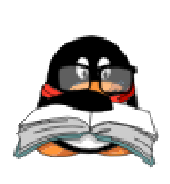

# QQpet-codex

QQpet-codex is a custom Codex desktop pet converted from QQPet QGG assets. It includes a microphone hover animation and comes packaged as a Codex skill for easy installation.

QQpet-codex 是一个由 QQ 宠物 QGG 素材转换而来的 Codex 桌面宠物，hover 状态使用麦克风动作，并以 Codex skill 的形式打包，方便安装和分享。

## Preview / 动画预览

| State / 状态 | Screenshot / 截图 | Source / 来源 |
| --- | --- | --- |
| Idle / 待机 |  | `1020010241.swf` |
| Running Right / 向右走 |  | `1028020241.swf` |
| Running Left / 向左走 |  | `1028020241.swf` mirrored |
| Waving / 招手 |  | `1023010221.swf` |
| Hover / hover 麦克风 |  | `1023010221.swf` |
| Failed / 失败 |  | `1020000541.swf` |
| Waiting Sleep / 等待睡觉 |  | `1020041221.swf` |
| Running Active / 运行中 |  | `1020070521.swf` |
| Review Book / 读书检查 |  | `1020100221.swf` |

## Install / 安装

Clone this repository into your Codex skills folder:

将仓库克隆到 Codex 的 skills 目录：

```bash
git clone https://github.com/chenboos5/QQpet-codex.git ~/.codex/skills/QQpet-codex
```

Run the installer:

运行安装脚本：

```bash
bash ~/.codex/skills/QQpet-codex/scripts/install_QQpet_codex.sh
```

The pet will be installed to:

宠物会安装到：

```bash
~/.codex/pets/QQpet-codex
```

Then restart Codex or refresh the pet list, and select `QQpet-codex`.

然后重启 Codex 或刷新宠物列表，选择 `QQpet-codex`。

## Included / 包含内容

- `SKILL.md`: Codex skill instructions / Codex skill 说明
- `scripts/install_QQpet_codex.sh`: installer / 安装脚本
- `assets/QQpet-codex/pet.json`: pet metadata / 宠物配置
- `assets/QQpet-codex/spritesheet.png`: pet animation sheet / 宠物动画图集
- `assets/QQpet-codex/source-mapping.json`: source animation mapping / 源动画映射
- `assets/previews/*.png`: README screenshots / README 预览截图

## Notes / 说明

- The installer copies bundled assets into your local Codex pets directory.
- No SWF conversion is required during installation.
- If `CODEX_HOME` is set, the installer uses `$CODEX_HOME/pets/QQpet-codex`; otherwise it uses `~/.codex/pets/QQpet-codex`.

- 安装脚本会把内置资源复制到本机 Codex pets 目录。
- 安装时不需要重新转换 SWF。
- 如果设置了 `CODEX_HOME`，会安装到 `$CODEX_HOME/pets/QQpet-codex`；否则安装到 `~/.codex/pets/QQpet-codex`。
