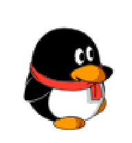
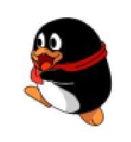
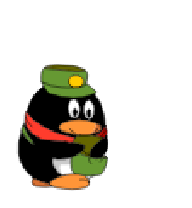

# QQpet-codex

QQpet-codex is a custom Codex desktop pet converted from QQPet QGG assets. This version corrects left/right running directions, uses a larger motion hover animation, keeps the microphone animation as the waving state, and uses an instrument-checking animation for review.

QQpet-codex 是一个由 QQ 宠物 QGG 素材转换而来的 Codex 桌面宠物。当前版本已修正左右走路方向，把 hover 换成了动作更明显的动画，麦克风动作保留在 waving 状态，并把 review 换成了检查/操作仪器的动画。

## Preview / 动画预览

The previews below are animated PNGs generated from the bundled spritesheet. If they appear static in a Markdown client, open the image or view the repository on GitHub.

下面的预览图是从内置 spritesheet 生成的动态 PNG。如果某些 Markdown 客户端里看起来不动，可以打开图片或在 GitHub 页面查看。

| State / 状态 | Spritesheet row / 图集行 | Trigger / 触发语义 | Animated Preview / 动态预览 | Source / 来源 |
| --- | --- | --- | --- | --- |
| `idle` / 待机 | 0 | Default resting pose / 默认待机 |  | `1020010241.swf` |
| `running-left` / 向左走 | 1 | Move left / 向左移动 |  | `1028020241.swf` mirrored |
| `running-right` / 向右走 | 2 | Move right / 向右移动 |  | `1028020241.swf` |
| `waving` / 招手 | 3 | Greeting fallback; microphone pose / 打招呼备用状态，麦克风动作 |  | `1023010221.swf` |
| `jumping` / hover | 4 | Codex hover interaction / 鼠标悬浮触发 |  | `1020090221.swf` |
| `failed` / 失败 | 5 | Failed or interrupted state / 失败或中断状态 |  | `1020000541.swf` |
| `waiting` / 等待 | 6 | Waiting or idle timeout / 等待或长时间空闲 |  | `1020041221.swf` |
| `running` / 运行中 | 7 | Active task state / 任务运行中 |  | `1020070521.swf` |
| `review` / reviewing | 8 | Review mode; checking instrument / review 状态，检查/操作仪器 |  | `1029200331.swf` |

## Install / 安装

Clone this repository into your Codex skills folder:

将仓库克隆到 Codex 的 skills 目录：

```bash
git clone https://github.com/chenboos5/QQpet-codex.git ~/.codex/skills/QQpet-codex
```

Run the installer:

运行安装脚本：

```bash
bash ~/.codex/skills/QQpet-codex/scripts/install_QQpet_codex.sh
```

The pet will be installed to:

宠物会安装到：

```bash
${CODEX_HOME:-$HOME/.codex}/pets/QQpet-codex
```

Then restart Codex or refresh the pet list, and select `QQpet-codex`.

然后重启 Codex 或刷新宠物列表，选择 `QQpet-codex`。

## Included / 包含内容

- `SKILL.md`: Codex skill instructions / Codex skill 说明
- `scripts/install_QQpet_codex.sh`: installer / 安装脚本
- `assets/QQpet-codex/pet.json`: pet metadata / 宠物配置
- `assets/QQpet-codex/spritesheet.png`: pet animation sheet / 宠物动画图集
- `assets/QQpet-codex/source-mapping.json`: source animation mapping / 源动画映射
- `assets/previews/*.png`: animated README previews / README 动态预览

## Notes / 说明

- The installer copies bundled assets into your local Codex pets directory.
- No SWF conversion is required during installation.
- If `CODEX_HOME` is set, the installer uses `$CODEX_HOME/pets/QQpet-codex`; otherwise it uses `~/.codex/pets/QQpet-codex`.

- 安装脚本会把内置资源复制到本机 Codex pets 目录。
- 安装时不需要重新转换 SWF。
- 如果设置了 `CODEX_HOME`，会安装到 `$CODEX_HOME/pets/QQpet-codex`；否则安装到 `~/.codex/pets/QQpet-codex`。
